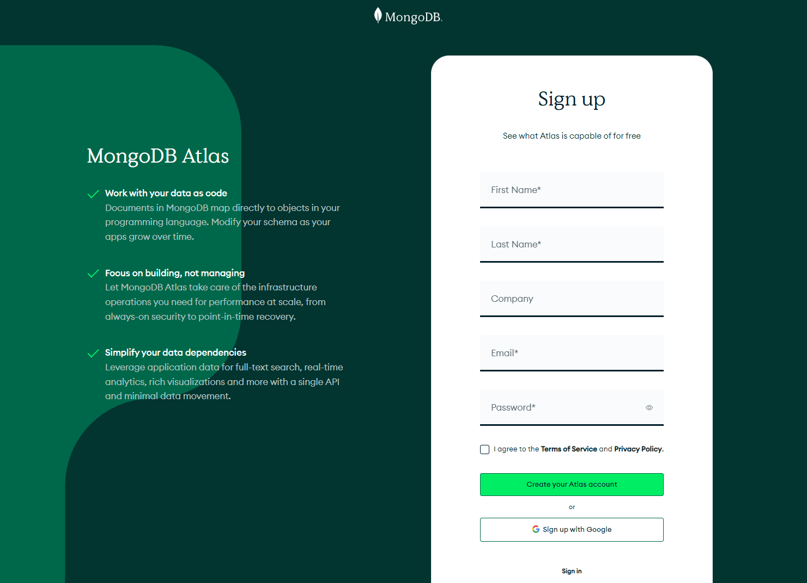
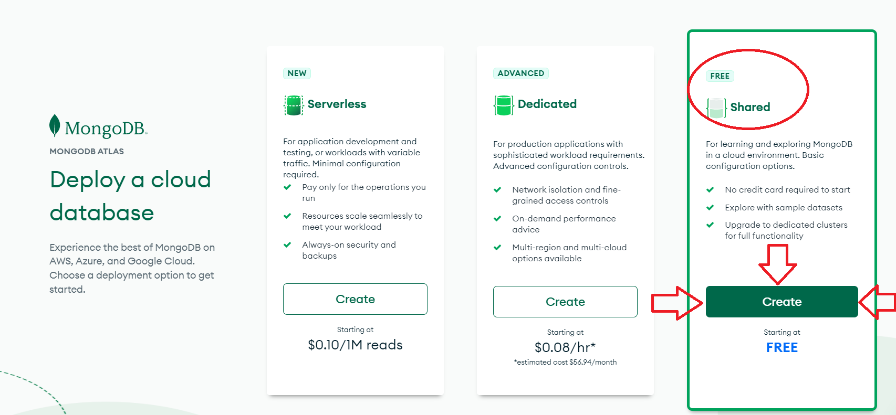
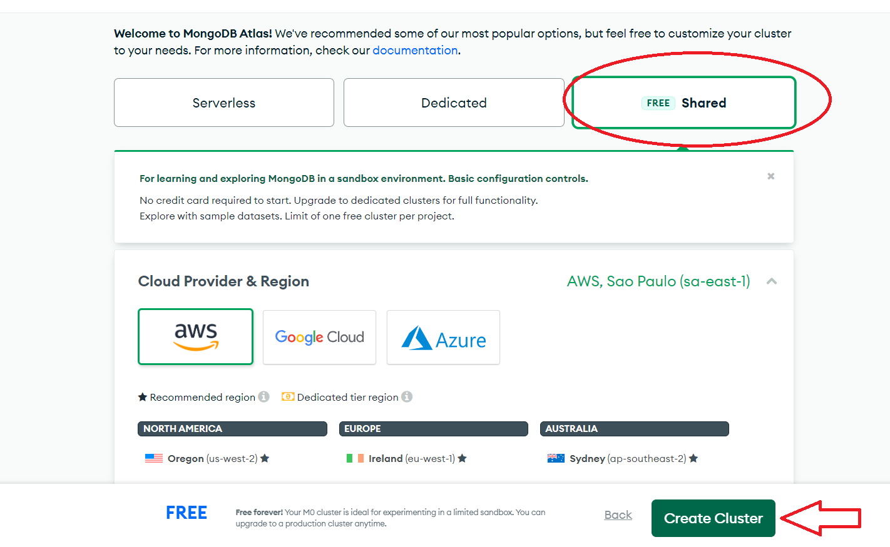
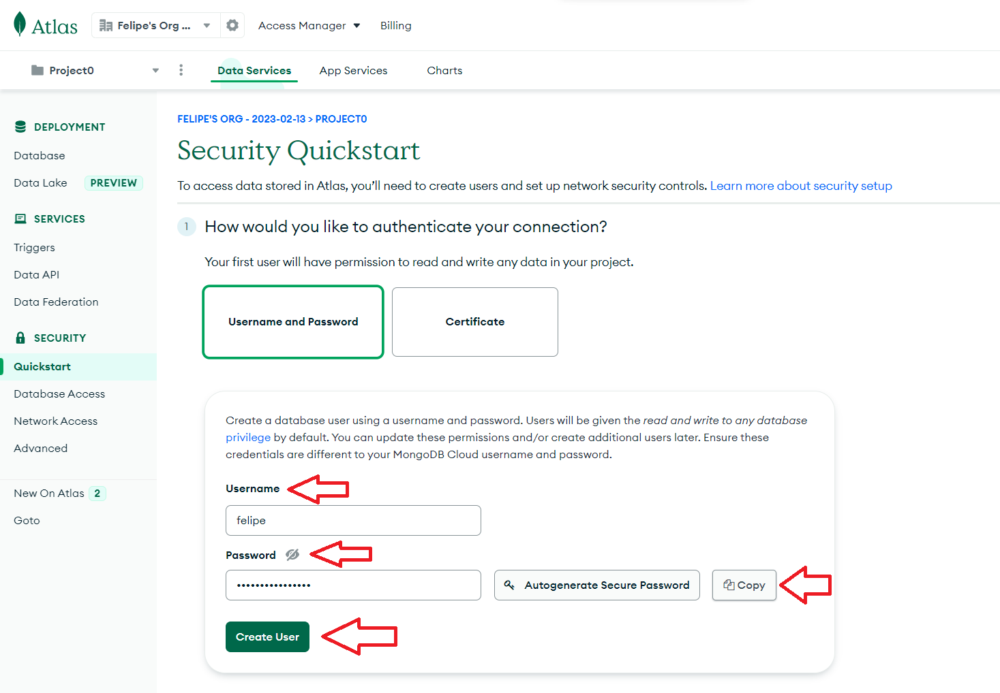
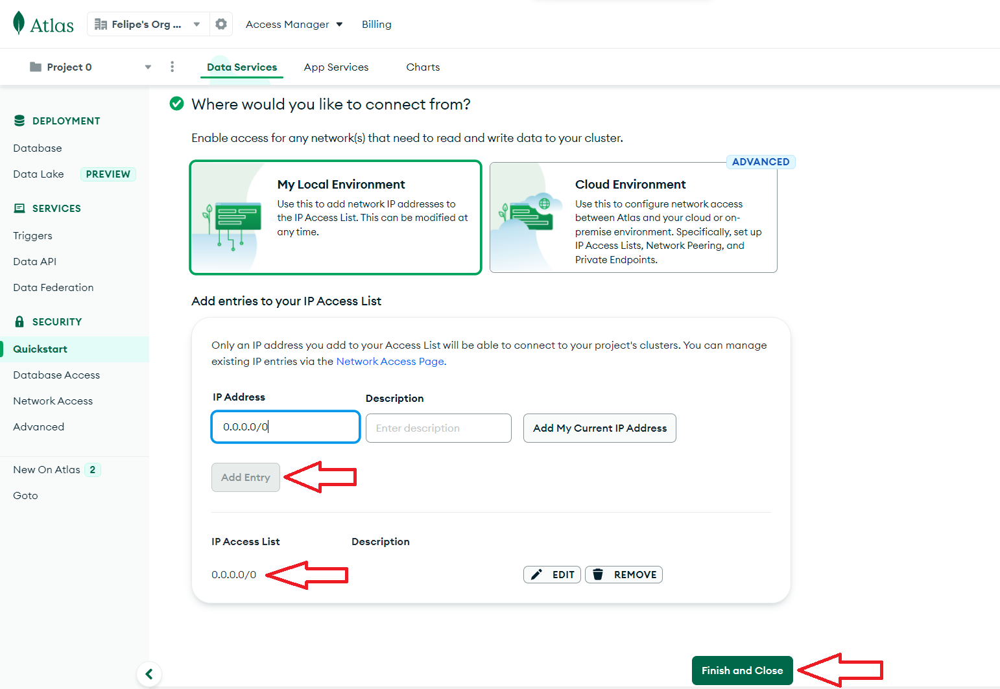
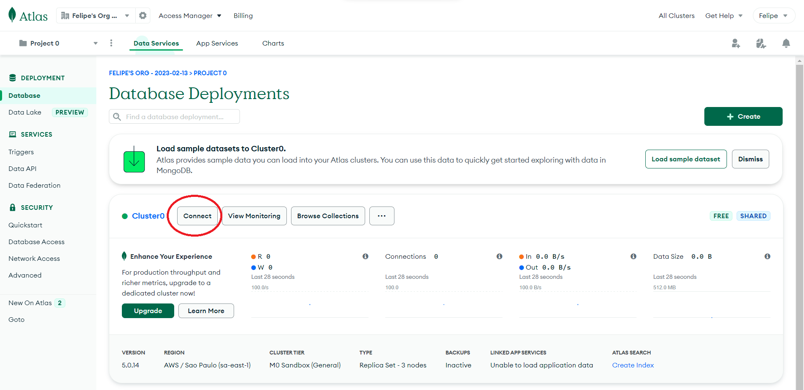
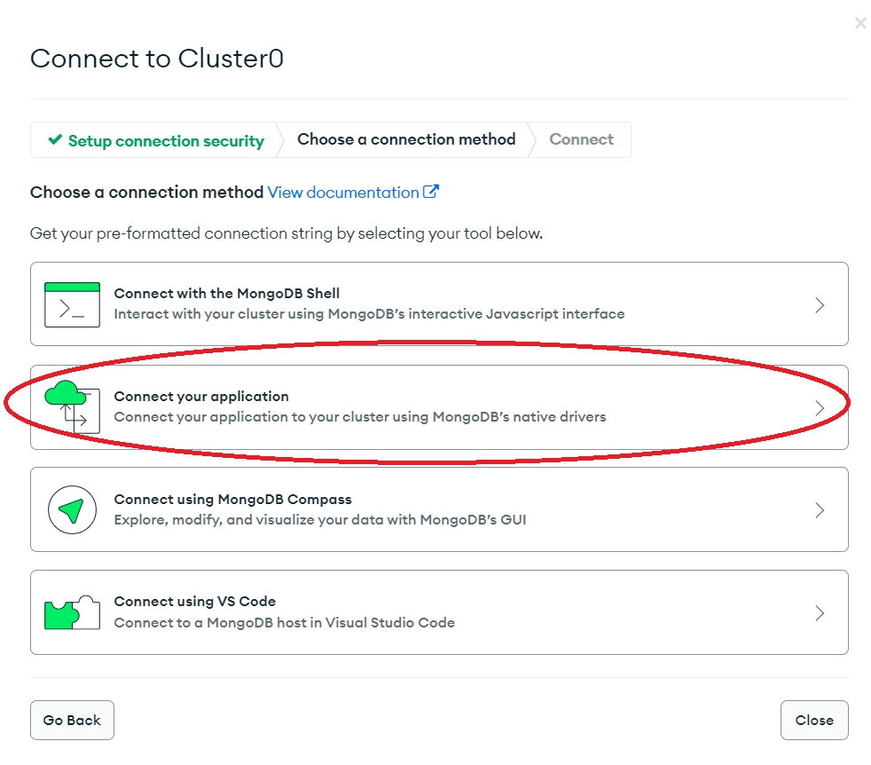
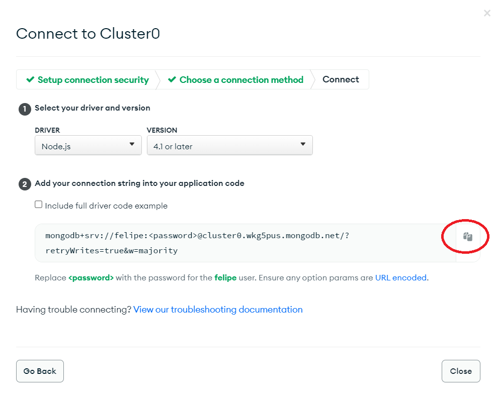
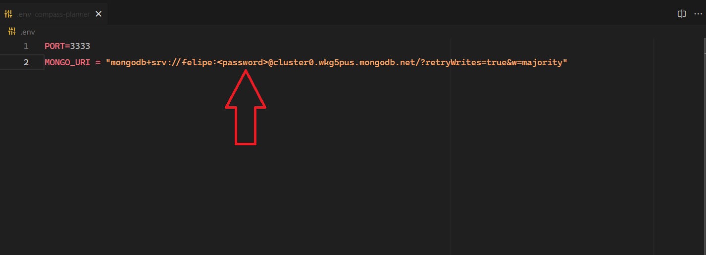

<h1 align="center"># 🚗 Welcome to Grid Motors API # 🚗</h1>

> This API will help the client to register cars, reserves, users and authentication.

### 🏠 [API Link on Heroku](https://grid-motors.herokuapp.com/api/v1)

## Install

Make sure to have Git (ver. 2.40.0) , Node.js (ver. 18.15.0) and npm (ver. 9.5.0) installed and use your terminal to follow the steps below:

```sh
git clone https://github.com/febomtempo/grid-motors-api.git
cd grid-motors-api/
npm install
```

## Getting Started

First you will need to create a MongoDB Atlas Cluster following this 9 steps:

<table><tr>
<td>  </td>
<td>  </td>
<td>  </td>

</tr></table>
<table><tr>
<td>  </td>
<td>  </td>
<td>  </td>

</tr></table>
<table><tr>
<td>  </td>
<td>  </td>
<td>  </td>

</tr></table>

```bash
  1 - Go to https://www.mongodb.com/cloud/atlas/register to register and sign in.
  2 - After Sign in, choose the last option to create a Free Database.
  3 - Select the Free (Shared Option) and click "Create Cluster".
  4 - Create a User setting up an username and password (do not forget to save this password)
  5 - Add a new entry to IP Access List (0.0.0.0/0), and click "Finish and Close".
  6 - After the last step, click "Connect".
  7 - Now click "Connect you application".
  8 - Copy the connection string.
  9 - Back to the code, create a .env file and set it up like ".env.example" example, paste the connection string from last step and change "<password>" with the password you created before on step 4.
```

## Usage

Now that you created the .env file, just run the codes below:

```sh
npm run build
npm start
```

## API Documentation

For all routes, use this address: 127.0.0.1:PORT (3000 in our example) before. For example to get all cars you have to
do a get request like this: 127.0.0.1:3000/api/v1/cars.

In routes that AUTH is needed, use the Bearer Token for Authorization in the Header. You can get the token after an authentication.

## GET Routes

#### Return all Cars

```http
  GET /api/v1/car
  You can use query params in this route.
  Example: GET /api/v1/cars?model=Fusca
```

| Query Parameters                                                        | Type     | Description                                                        |
| :---------------------------------------------------------------------- | :------- | :----------------------------------------------------------------- |
| `model, color, year, value_per_day, accessories, number_of_passengers ` | `string` | **Optional.** It will return all cars that matches with the params |

#### Return a specific Car (Needs AUTH)

```http
  GET /api/v1/car/:id
```

| Query Parameter | Type     | Description                          |
| :-------------- | :------- | :----------------------------------- |
| `id`            | `string` | **Required**. Car ID you want to get |

#### Return all Users (Needs AUTH)

```http
  GET /api/v1/user
  You can use query params in this route.
  Example: GET /api/v1/user?name=João
```

| Query Parameters                                                                         | Type     | Description                                                         |
| :--------------------------------------------------------------------------------------- | :------- | :------------------------------------------------------------------ |
| `name, cpf, birth, email, cep, qualified, patio, complement, neighborhood, locality, uf` | `string` | **Optional.** It will return all users that matches with the params |

#### Return a specific User (Needs AUTH)

```http
  GET /api/v1/user/:id
```

| Query Parameter | Type     | Description                           |
| :-------------- | :------- | :------------------------------------ |
| `id`            | `string` | **Required**. User ID you want to get |

#### Return all Reserves (Needs AUTH)

```http
  GET /api/v1/reserve
  You can use query params in this route.
  Example: GET /api/v1/reserve?final_value=500
```

| Query Parameters                                      | Type     | Description                                                            |
| :---------------------------------------------------- | :------- | :--------------------------------------------------------------------- |
| `start_date , end_date, id_user, id_car, final_value` | `string` | **Optional.** It will return all reserves that matches with the params |

#### Return a specific Reserve (Needs AUTH)

```http
  GET /api/v1/reserve/:id
```

| Query Parameter | Type     | Description                              |
| :-------------- | :------- | :--------------------------------------- |
| `id`            | `string` | **Required**. Reserve ID you want to get |

## POST Routes

#### Create User

```http
  POST /api/v1/user
```

| Body        | Type     | Description                  |
| :---------- | :------- | :--------------------------- |
| `name`      | `string` | **Required**. Full Name      |
| `cpf`       | `string` | **Required**. CPF            |
| `birth`     | `Date`   | **Required**. Birth Date     |
| `email`     | `string` | **Required**. E-mail         |
| `password`  | `string` | **Required**. Password       |
| `cep`       | `string` | **Required**. CEP            |
| `qualified` | `string` | **Required**. 'sim' or 'não' |

#### User Authenticate

```http
  POST /api/v1/authenticate
```

| Body       | Type     | Description            |
| :--------- | :------- | :--------------------- |
| `email`    | `string` | **Required**. E-mail   |
| `password` | `string` | **Required**. Password |

#### Create Car (Needs AUTH)

```http
  POST /api/v1/car
```

| Body                   | Type       | Description                        |
| :--------------------- | :--------- | :--------------------------------- |
| `model`                | `string`   | **Required**. Car Model            |
| `color`                | `string`   | **Required**. Car Color            |
| `year`                 | `string`   | **Required**. Car Year             |
| `value_per_day`        | `number`   | **Required**. Value per Day        |
| `accessories`          | `string[]` | **Required**. Accessories          |
| `number_of_passengers` | `integer`  | **Required**. Number of Passengers |

#### Create Reserve (Needs AUTH)

```http
  POST /api/v1/reserve
```

| Body         | Type     | Description              |
| :----------- | :------- | :----------------------- |
| `start_date` | `Date`   | **Required**. Start Date |
| `end_date`   | `Date`   | **Required**. End Date   |
| `id_car`     | `string` | **Required**. Car ID     |

## PUT Routes

#### Update User (Needs AUTH)

```http
  PUT /api/v1/user/:id
```

| Body        | Type     | Description                  |
| :---------- | :------- | :--------------------------- |
| `name`      | `string` | **Optional**. Full Name      |
| `cpf`       | `string` | **Optional**. CPF            |
| `birth`     | `Date`   | **Optional**. Birth Date     |
| `email`     | `string` | **Optional**. E-mail         |
| `password`  | `string` | **Optional**. Password       |
| `cep`       | `string` | **Optional**. CEP            |
| `qualified` | `string` | **Optional**. 'sim' or 'não' |

#### Update Car (Needs AUTH)

```http
  PUT /api/v1/car/:id
```

| Body                   | Type       | Description                        |
| :--------------------- | :--------- | :--------------------------------- |
| `model`                | `string`   | **Optional**. Car Model            |
| `color`                | `string`   | **Optional**. Car Color            |
| `year`                 | `string`   | **Optional**. Car Year             |
| `value_per_day`        | `number`   | **Optional**. Value per Day        |
| `accessories`          | `string[]` | **Optional**. Accessories          |
| `number_of_passengers` | `integer`  | **Optional**. Number of Passengers |

#### Update Reserve (Needs AUTH)

```http
  PUT /api/v1/reserve/:id
```

| Body         | Type     | Description              |
| :----------- | :------- | :----------------------- |
| `start_date` | `Date`   | **Optional**. Start Date |
| `end_date`   | `Date`   | **Optional**. End Date   |
| `id_car`     | `string` | **Optional**. Car ID     |
| `id_user`    | `string` | **Optional**. User ID    |

## DELETE Routes

#### Delete an User (Needs AUTH)

```http
  DELETE /api/v1/user/:id
```

| Query Parameter | Type     | Description                              |
| :-------------- | :------- | :--------------------------------------- |
| `id`            | `string` | **Required**. User ID you want to delete |

#### Delete a Car (Needs AUTH)

```http
  DELETE /api/v1/car/:id
```

| Query Parameter | Type     | Description                             |
| :-------------- | :------- | :-------------------------------------- |
| `id`            | `string` | **Required**. Car ID you want to delete |

#### Delete a Reserve (Needs AUTH)

```http
  DELETE /api/v1/reserve/:id
```

| Query Parameter | Type     | Description                                 |
| :-------------- | :------- | :------------------------------------------ |
| `id`            | `string` | **Required**. Reserve ID you want to delete |

## Author

👤 **Felipe Bomtempo**

- Github: [@febomtempo](https://github.com/febomtempo)
- LinkedIn: [Felipe Bomtempo](https://www.linkedin.com/in/felipe-bomtempo/)

---

---
